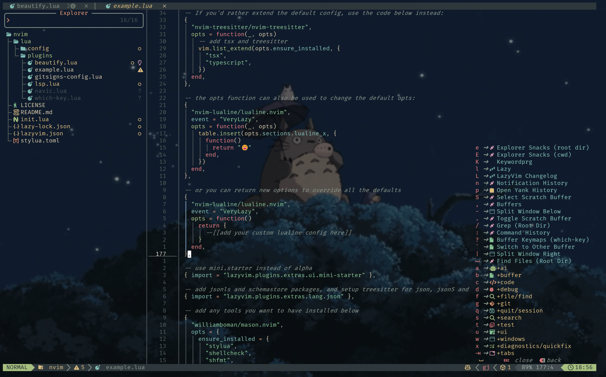

# 🏔️ Alpine Neovim - My Personal Configuration

This is my personal Neovim configuration, built upon the excellent [LazyVim](https://www.lazyvim.org/) distribution. The guiding philosophy behind this setup is to create an **elegant, clean, serene, and immersive** coding environment, inspired by the tranquility and beauty of the Alps.

Every plugin and setting has been carefully curated to enhance focus, comfort, and long-term programming happiness, without sacrificing the power and speed of Neovim.



## ✨ Core Philosophy: The Alpine Style

- **Serenity & Immersion: ** A fully transparent UI allows the beautiful desktop background (like a serene Totoro forest) to shine through, creating a deep, immersive experience. Distractions are minimized, allowing for complete focus on the code.
- **Elegance & Finesse: ** From the custom "Alpine pictogram" icons in the breadcrumbs to the subtle "Glacial Crevice" cursorline and the "Flowing Stream" indent guides, every visual detail has been polished to create a harmonious and aesthetically pleasing interface.
- **Clean & Comfortable: ** Adhering to the "less is more" principle, the UI is stripped of unnecessary clutter. The floating statusline, minimalist bufferline, and a tranquil startup screen all contribute to a comfortable, low-fatigue coding session.
- **Powered by AI: ** Deep integration with **GitHub Copilot** and **Copilot Chat** transforms the editor into an intelligent co-pilot, while the seamless use of **Gemini CLI** in the terminal handles complex command-line tasks.

## 🚀 Key Features & Customizations

### Visuals & Aesthetics

- **Theme:** [Everforest](https://github.com/sainnhe/everforest) with a hard background and full transparency.
- **Font:** [Fira Code Nerd Font](https://www.nerdfonts.com/font-downloads) for beautiful ligatures and icons.
- **Immersive UI:**
  - Fully transparent background for the editor, file tree, and pop-up menus.
  - **"Glacial Crevice"**: A subtle underline for the current line number instead of a jarring full-line highlight.
  - **"Flowing Stream"**: Custom-colored, gentle indent guides that resemble a flowing stream.
  - **"Forest Whispers"**: A transparent `which-key` menu that feels light and unobtrusive.
- **Custom Icons:** A hand-picked set of nature-themed icons for `nvim-navic` (breadcrumbs) and diagnostics, creating a unique "Alpine pictogram" language.
- **Dynamic Cursor:** A smooth, smearing cursor effect via `smear-cursor.nvim`, providing a modern feel without a GUI.

### Productivity & Workflow

- **AI Suite:**
  - **GitHub Copilot & Copilot Chat:** For intelligent code completion and in-editor conversations.
  - **Gemini CLI:** For natural language to shell command translation in the terminal.
- **Git Integration:**
  - **GitUI:** A powerful and intuitive terminal UI for managing Git repositories, accessible with a keymap.
  - **Gitsigns:** With custom, modern icons and subtle animations for a lively feel.
- **Core Editor Enhancements (via LazyVim 14.x+):**
  - **File Finding:** `fzf-lua` for blazing-fast fuzzy finding.
  - **Code Completion:** `blink.cmp` providing a snappy and intelligent completion experience.
  - **UI/UX Core:** `snacks.nvim` powering a smooth, modern interface with features like Zen Mode and seamless scrolling.
- **Navigation:**
  - **Breadcrumbs:** `nvim-navic` integrated into a floating `lualine` to always know your location in the code.
  - **Efficient Movement:** Custom keymaps and plugins for a comfortable, keyboard-driven workflow.

## 📦 Installation

This configuration is managed by [Lazy.nvim](https://github.com/folke/lazy.nvim).

1.  **Backup your existing Neovim configuration:**
    ```bash
    # For Linux/macOS
    mv ~/.config/nvim ~/.config/nvim.bak
    mv ~/.local/share/nvim ~/.local/share/nvim.bak

    # For Windows (PowerShell)
    mv ~\AppData\Local\nvim ~\AppData\Local\nvim.bak
    mv ~\AppData\Local\nvim-data ~\AppData\Local\nvim-data.bak
    ```
2.  **Clone this repository:**
    ```bash
    git clone https://github.com/SpringWu5/neovim_config.git ~/.config/nvim
    ```
3.  **Launch Neovim:**
    ```bash
    nvim
    ```
    Lazy.nvim will automatically install all the plugins on the first run.

## 🙏 Acknowledgements

- **LazyVim:** For providing an incredible, modern, and extensible Neovim distribution.
- **The Neovim community:** For creating the amazing plugins that make this configuration possible.

---
*Crafted with care, for a serene and productive coding journey.*
